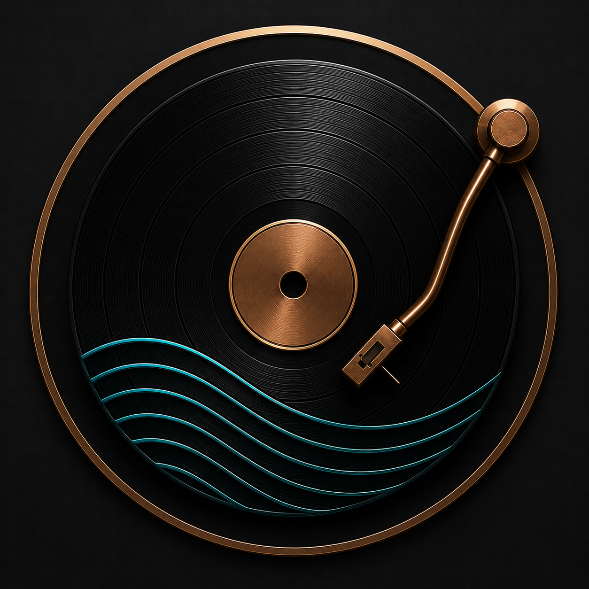

<p align="center">
  
</p>

<h1 align="center">Kissa</h1>

<p align="center">
  <strong>A cinematic desktop music player built around the feeling of listening to a record.</strong>
</p>

<p align="center">
  
  
  
  
  
  
</p>

<p align="center">
  <a href="https://github.com/NamanOG/Kissa/releases/latest">
    
  </a>
</p>

---

Kissa is a desktop music player inspired by Japan's iconic *Jazz Kissa* (ジャズ喫茶) listening rooms — intimate spaces built around careful listening, good sound, and atmosphere.

Instead of treating music as another application window, Kissa turns your desktop into a quiet listening space built around a physical turntable, record shelf, ambient environments, synchronized lyrics, and tactile hardware-inspired controls. 

Play local music, follow what's playing across Windows, or simply leave Kissa open as a visual companion to your listening. 

> **The music plays. The room responds.**

---

## 💾 Download

Get the latest version for **Windows 10 / 11** from the [**Releases Page**](https://github.com/NamanOG/Kissa/releases/latest).

### Windows
- **`Kissa-Setup-x.x.x.exe`** — Standard installer with Start Menu and desktop integration.
- **`Kissa-Portable-x.x.x.exe`** — Standalone version requiring no installation.

> **Windows SmartScreen:** Kissa is currently distributed independently and is not code-signed. Windows may display a SmartScreen warning when installing. If you trust the source, select **More info → Run anyway**.

---

## ✨ Features

### 💿 The Turntable
Kissa's main player is built around a physical turntable-inspired interface.
- Machined hardware-inspired turntable design
- Animated vinyl rotation at 33⅓ and 45 RPM
- Physical tonearm interaction
- Needle-drop playback
- Tonearm seeking
- Smooth start and stop behavior
- Continuous rotational phase preservation
- Tactile hardware controls
- Physical lighting and material details

The interface is designed to make playback feel like operating a piece of equipment rather than controlling a web player.

---

### 📚 Record Shelf
Keep your music collection in an archival-style record shelf.
- Physical record presentation
- Stable, shelf-like album layouts
- Album inspection panel
- Track browsing
- Recent, Added, Played and Alpha sorting
- Multi-record selection
- Record removal and sharing
- Archival-inspired catalog typography
- Restrained physical interactions and animations

Your collection feels less like a database and more like a cabinet of records.

---

### 🎤 Synchronized Lyrics
Kissa provides real-time synchronized lyrics designed for immersive listening.
- Accurate timestamp synchronization
- Word-level karaoke progression
- Automatic lyric scrolling
- Click-to-seek lyric lines
- Cinematic active-line hierarchy
- Optical depth between active and inactive lyrics
- Improved readability for long lyrics
- Smooth fullscreen lyric presentation
- LRCLIB integration

The lyrics are designed to become part of the listening environment rather than dominate it.

---

### 🌌 Listening Environments
Choose from curated environments that change the atmosphere surrounding the turntable.
1. **01 — Quiet Listening Room**
   Walnut, warm paper and late-night lamp glow.
2. **02 — Dusty Record Store**
   Faded sleeves, cardboard and muted olive.
3. **03 — Japanese Jazz Bar**
   Charcoal, indigo, warm wood and dim light.
4. **04 — Midnight Apartment**
   Smoky blue, graphite and midnight quiet.
5. **05 — Rainy Window**
   Grey skies, soft reflections and warm indoor light.
6. **06 — Hi-Fi Library**
   Dark wood, parchment and aged brass.
7. **07 — Concrete & Vinyl**
   Soft concrete, terracotta and matte black.
8. **08 — Sunday Morning**
   Warm linen, pale wood and faded sage.

---

### 🎨 Match Album
Let the music influence the room.
- Album artwork drives the surrounding atmosphere
- Multiple colors can contribute to the environment
- Dark artwork remains restrained
- Vibrant artwork produces richer ambient lighting
- Smooth transitions between album atmospheres
- Turntable hardware remains visually grounded
- Artwork colors subtly influence the surrounding environment

**The album becomes the light source for the room.**

---

### 🖥️ Mini Player
A compact version of Kissa designed to stay alongside your desktop.
- Dedicated Mini Player window
- Always-on-top listening companion
- Playback controls
- Track information
- Scrubbing
- Compact turntable presentation
- Native window behavior

---

### 🪟 Windows Media Integration
Kissa integrates with Windows System Media Transport Controls.
- Windows media session synchronization
- Spotify integration
- Apple Music integration
- Tidal and browser media support
- System tray controls
- External playback detection
- Automatic switching between Kissa and external media
- Synchronized playback metadata and progress

Kissa does not replace streaming applications. It acts as a visual listening interface alongside them.

---

### 🎛️ Hardware-Inspired Controls
Kissa's controls are designed around physical audio equipment rather than conventional web UI.
- Mechanical power controls
- 33⅓ / 45 RPM speed selection
- Start / Stop controls
- Tonearm interaction
- Hardware-style transport controls
- Mechanical room-control feedback
- Tactile visual states
- Keyboard shortcuts for playback and navigation

---

### 🔄 Check for Updates
Kissa includes a built-in manual update checker. From Settings you can:
- Check whether a newer version is available
- See your currently installed version
- View the latest release directly
- Access the official Kissa release page without manually searching GitHub

Updates remain intentionally unobtrusive and user-controlled.

---

## ⚡ Performance
Kissa is designed to keep high-frequency visual updates away from the React render lifecycle wherever possible.
- GPU-friendly compositor animations
- Web Animations API for vinyl rotation
- CSS-variable driven lyric synchronization
- Lightweight Canvas-based visualizer
- Native Windows media synchronization
- Optimized playback clock architecture
- Minimal React updates during active playback

The goal is simple: **The interface should feel as smooth as the music.**

---

## 🛠️ Tech Stack

| Layer | Technology | Purpose |
| --- | --- | --- |
| **Runtime** | Electron 39 | Windows desktop shell, native IPC and window management |
| **Build System** | `electron-vite` / Vite 7 | Application bundling and optimized builds |
| **Frontend** | React 19 + TypeScript | Component architecture |
| **Animation** | Web Animations API + Framer Motion 12 | High-performance playback and UI motion |
| **Graphics** | Canvas API + CSS | Visualizer, materials and ambient effects |
| **State** | Zustand 5 | Application state and preferences |
| **Styling** | TailwindCSS v3 + CSS Variables | Kissa visual system |
| **Windows Media** | `@coooookies/windows-smtc-monitor` | Windows System Media Transport Controls |
| **Lyrics** | LRCLIB | Synchronized lyric retrieval |

---

## 🚀 Getting Started

### Prerequisites
- **Node.js:** `>= 20.0.0`
- **npm:** `>= 10.0.0`
- **OS:** Windows 10 or Windows 11

*Windows is required for development of the native System Media Transport Controls integration.*

### Development Setup

```bash
# Clone the repository
git clone https://github.com/NamanOG/Kissa.git
cd Kissa

# Install dependencies
npm install

# Start development mode
npm run dev
```

### Building for Windows

```bash
# Build Windows installer and portable executable
npm run build:win --workspace apps-desktop

# Create an unpacked build for local testing
npm run build:unpack --workspace apps-desktop
```

### Quality Checks

```bash
# Run the test suite
npm run test

# Run TypeScript type checking
npm run typecheck

# Run ESLint
npm run lint
```

## 🗺️ Roadmap

Kissa is intentionally focused on the listening experience. Future development may explore:

### 🪟 Deeper Windows Integration
- Richer Windows media surfaces
- Lock-screen media integration
- Improved global media-key handling
- Background playback refinements
- Additional Windows notification integration

### 🌌 Ambient Desktop
- Optional ambient desktop mode
- Live wallpaper-style listening environments
- Expanded connection between the desktop and current listening atmosphere

### 🎨 More Listening Environments
- Additional curated rooms
- New physical materials
- Seasonal and time-based environments
- More album-reactive atmospheres

### 🎛️ Deeper Hardware Interaction
- More detailed tonearm physics
- Additional physical controls
- Subtle needle and record surface sounds
- More tactile interaction feedback

### 📊 Listening Insights
- Private local listening statistics
- Listening sessions
- Personal listening history
- Optional listening patterns and insights

*Streaming Services: Kissa does not plan to become a native Spotify, Apple Music or other closed-platform streaming client. Kissa remains focused on local playback and seamless Windows System Media synchronization.*

## 📜 Version History

### v4.0.0 — The Listening Machine
A major evolution of Kissa focused on the physical listening experience.
- Redesigned Listening Room
- New archival Record Shelf
- Refined turntable and tonearm interactions
- Cinematic synchronized lyrics
- Refined Match Album environments
- Hardware-inspired controls
- Improved Windows media integration
- Mini Player refinements
- Manual update checking
- Major visual, interaction and responsive-layout refinement
- Extensive playback, synchronization and stability improvements

### v3.0.1 — The Room Responds
- Match Album adaptive atmosphere
- Artwork-driven ambient lighting
- Improved artwork color extraction
- Playback duration and Windows media synchronization improvements
- Tonearm and lyrics refinements
- Mini Player improvements
- UI interaction fixes
- Production polish

### v3.0.0
Major performance, architecture and visual refinement.
- Unified playback architecture
- High-performance vinyl animation
- Dedicated Mini Player
- Listening environments
- Hardware-inspired controls
- Improved lyrics
- Queue and playback improvements

### v1.0.0
Initial Kissa release featuring the turntable interface, Windows media synchronization, synchronized lyrics and listening environments.

## 📄 License
MIT © [NamanOG](https://github.com/NamanOG)
